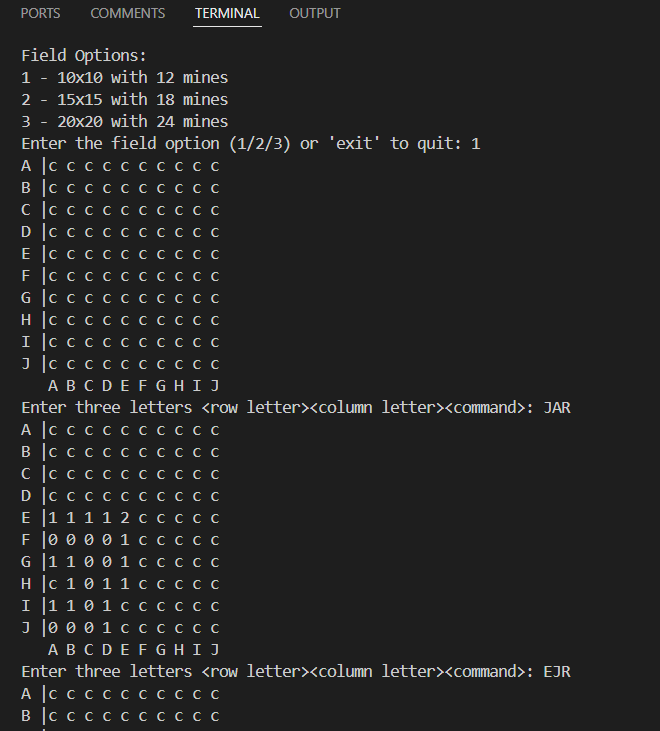

# Mine-Sweeper-Game

Group Members
21/ENG/028 G.D.M.Pramodi
21/ENG/069 L.W.S.Kularatne
21/ENG/165 W.P.S.S. Dharmarathna

## 🎮 Mine Sweeper - A Console-Based Game

### 🏆 Object-Oriented Game Development

**📌 Project Overview**  
This console-based Mine Sweeper game is designed as part of the CO2210 Programming Quest at the Department of Computer Engineering, University of Sri Jayewardenepura. The project focuses on:  
✅ Implementing Object-Oriented Programming (OOP) principles 🏗️  
✅ Developing an interactive console-based game 🕹️  
✅ Enhancing GitHub collaboration & version control 🔄  
✅ Managing game logic & user interactions efficiently ⚡

**🎯 Objective**  
The goal of this game is to uncover all safe locations while avoiding hidden mines. The player wins when all flags are correctly placed on mine-buried locations. If a mine is revealed, the game ends.

**🏗️ How the Game Works**  
🔹 Step 1: Choose a minefield size (10×10, 15×15, or 20×20).  
🔹 Step 2: The game board appears covered (c). Mines are randomly placed.  
🔹 Step 3: The player enters commands in <Row Letter><Column Letter><Command> format:  
F → Place a flag (e.g., EEF → flag at E, E).  
R → Reveal a location (e.g., HCR → reveal H, C).  
🔹 Step 4: If the revealed location is empty, it displays the count of neighboring mines. If no mines are nearby, the area is automatically uncovered.  
🔹 Step 5: The game continues until the player either wins or reveals a mine.

